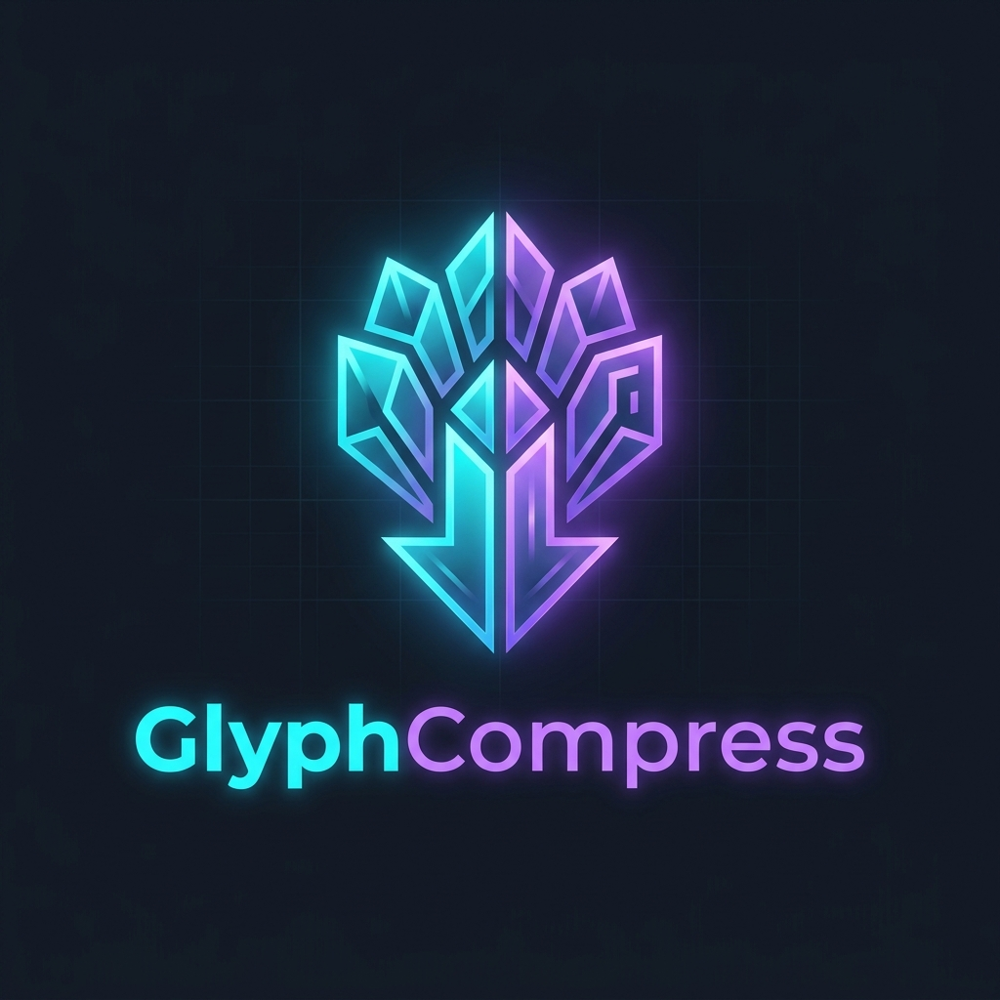

<h1 align="center">⚡ GlyphCompress</h1>

<p align="center">
  
</p>

<p align="center">
  <a href="https://www.npmjs.com/package/glyph-compress"></a>
  <a href="https://opensource.org/licenses/AGPL-3.0"></a>
  <a href="COMMERCIAL_LICENSE.md"></a>
  <a href="https://marketplace.visualstudio.com/items?itemName=neolambo.glyph-compress"></a>
  <a href="https://github.com/Neolambo/glyph-compress/releases"></a>
</p>

<p align="center">
  <strong>Semantic compression for IDE↔LLM communication — CLI, VS Code extension, and MCP server, with reversible-by-default compression calibrated against real provider tokenizers.</strong>
</p>
<p align="center">
  Up to 90%+ savings on well-suited payloads (see benchmarks below); real aggregate savings on the project's own benchmark suite is a more modest, honestly-reported 22%.
</p>

<p align="center">
  <a href="#-quick-start">Quick Start</a> ·
  <a href="#-usage-command-line-cli">CLI</a> ·
  <a href="#-mcp-server-claude-code-claude-desktop--other-mcp-clients">MCP Server</a> ·
  <a href="#-when-to-use-glyphcompress-and-when-to-skip-it">When to Use / Skip</a> ·
  <a href="#-benchmarks">Benchmarks</a> ·
  <a href="CASE_STUDY.md">Case Study</a> ·
  <a href="https://github.com/Neolambo/glyph-compress/releases">Releases</a> ·
  <a href="ROADMAP.md">Roadmap</a> ·
  <a href="llms.txt">llms.txt</a> ·
  <a href="LICENSE">License</a>
</p>

GlyphCompress uses a compositional radical-based encoding system (inspired by Chinese logograms) to compress the verbose context exchanged between IDEs and Large Language Models. A shared codebook injected into the LLM's system prompt enables it to decode compact glyph sequences back into full semantic concepts.

### 🎬 See it in Action

Watch the latest YouTube video to see how GlyphCompress achieves 90% token savings:

- ⚙️ **[Data Flow Architecture](https://youtu.be/XRwRYEsReJU)**: A graphical animation showing how the engine minifies and translates verbose code into dense semantic glyphs.

---

## 📌 Table of Contents

- [🎯 The Problem](#-the-problem)
- [✨ The Solution](#-the-solution)
- [🧭 When to Use GlyphCompress (and When to Skip It)](#-when-to-use-glyphcompress-and-when-to-skip-it)
- [🔍 Realistic Session Showcase](#-realistic-session-showcase)
- [🧠 Advanced Features: Holographic Folding, Intent Diffs & History Decay](#-advanced-features-holographic-folding-intent-diffs--history-decay)
- [📊 Benchmarks](#-benchmarks)
- [🚀 Usage: Command Line (CLI)](#-usage-command-line-cli)
- [🚀 Quick Start (Code & Extension)](#-quick-start)
- [👻 The Ultimate Magic: Zero-Command Transparent Proxy](#-the-ultimate-magic-zero-command-transparent-proxy-v050)
- [🔌 MCP Server (Claude Code, Claude Desktop & other MCP clients)](#-mcp-server-claude-code-claude-desktop--other-mcp-clients)
- [🎯 Context Budget Planner](#-context-budget-planner)
- [🔤 The Glyph Protocol](#-the-glyph-protocol)
- [👥 Contributing](#-contributing)
- [⚖️ Dual Licensing Model](#%EF%B8%8F-dual-licensing-model)

---

## 🎯 The Problem

Every IDE→LLM request carries massive, redundant context. As coding sessions grow longer, the **chat history** accumulates exponentially, causing token costs to explode, performance to lag, and LLMs to hit context window limits:

```
System prompt:             ~2,000 tokens (repeated every time)
Open files:                ~3,000 tokens
Errors/diagnostics:        ~500 tokens  
Chat history (multi-turn): ~4,000 tokens (explodes exponentially)
User prompt:               ~500 tokens
─────────────────────────────────────────
TOTAL:                     ~10,000 tokens/request
```

At 50 requests/day → **500K tokens/day** → $8-15/day on Claude/GPT-4.

## ✨ The Solution

GlyphCompress intercepts outgoing LLM requests, compresses context using a shared codebook, and utilizes **experimental Attentional Decay Compaction (ADC)** to progressively condense older history into summaries, saving **80-90% of tokens** and enabling **near-infinite multi-turn chats**:

```
BEFORE (1,734 chars):
  { prompt: "Fix the error in UserProfile.tsx",
    files: [{ path: "src/components/UserProfile.tsx", content: "...44 lines..." }],
    diagnostics: [{ code: "TS2339", message: "Property 'department' does not exist on type 'User'" }] }

AFTER (137 chars):
  [F: ◈₍1₎=src/components/UserProfile.tsx]
  ⺌✗ ◈₍1₎
  ◈₍1₎ᵗ [imp:5 exp:1 ◇:4 ⟿:2 ⟳:5 44L]
  ◈₍1₎:42 ✗∉prop 'department'∉User

→ 12.7x compression, 92% saved
```

## 🧭 When to Use GlyphCompress (and When to Skip It)

This project reports honest numbers, not just best cases — so here's the direct answer on fit, backed by the measurements in [📏 Benchmark Snapshot](#-benchmark-snapshot-v1337) and [🧪 Realistic Benchmark Notes](#-realistic-benchmark-notes) below.

**Good fit:**
- **Code-heavy payloads** — source files, diffs, diagnostics. `ultra` shows real, structural token savings here (up to ~1.2x on this repository's own source), and identifiers/imports/structure survive intact via the source map.
- **Multi-turn IDE chat sessions** — the shared codebook is a one-time cost amortized across turns; Anthropic's cache-adjusted estimate on this repo's fixtures is ~28% even though the raw transmitted payload alone is closer to break-even.
- **Multi-file context** (Holographic Folding) and **git-diff review** (Intent Diffs) — structurally repetitive payloads where deterministic substitution has the most to work with.
- **Long-running conversations** that would otherwise blow a context window — Attentional Decay Compaction trades old-turn fidelity for indefinite session length, on purpose.

**Weak fit — GlyphCompress says so itself:**
- **Short, Unicode-light prose requests.** The ~400-token codebook header can outweigh what a small payload saves; the net-negative fallback (as of v1.30.0, requiring a real measured 10% improvement) detects this and sends the original unchanged rather than risking a silent regression.
- **One-off, single-turn requests on plain English text** — there's no repeated content for the dynamic dictionary to amortize, and no multi-turn cache to spread the codebook cost over.
- **Anything where you need the LLM to see exact original text** (e.g., verbatim quoting requirements, legal/contract review) — use `trustPolicy: lossless` or skip compression for that specific payload; `lossy`/`ultra` levels are explicitly irreversible by design.

**Not a substitute for:** provider-side prompt caching (Anthropic `cache_control`, OpenAI/Gemini implicit caching) — GlyphCompress **complements** caching (see the Anthropic hybrid wrapper) rather than replacing it; caching only helps repeated prefixes across calls, GlyphCompress reduces the token count of the content itself.

## 🔍 Realistic Session Showcase

GlyphCompress includes a built-in interactive demo benchmark (`npm run demo`) simulating real-world developer tasks (React debugging, SQL optimization, Python ML pipelines, YAML config) to measure character and token reduction. 

Here is what a typical compressed session telemetry looks like:

### 1. Fix TypeScript diagnostic in React Component
* **Original Context**: `1,734 chars` (includes `UserProfile.tsx` contents, history, and TS2339 error code).
* **Compressed Output**: `137 chars` (**12.7x compression, 92% saved**).
* **Emitted Payload**:
  ```text
  [F: ◈₍1₎=src/components/UserProfile.tsx]
  ⺌✗ ◈₍2₎
  ◈₍1₎ᵗ [imp:5 exp:1 ◇:4 ⟿:2 ⟳:5 44L]
  ◈₍1₎:42 ✗∉prop 'department'∉User
  [T1:U:⺍▲] [T2:A:⺍▲]
  ```

### 2. Optimize slow Prisma/SQL API endpoint
* **Original Context**: `1,999 chars` (includes two TS controller/service files, Express imports, and history).
* **Compressed Output**: `195 chars` (**10.3x compression, 90% saved**).
* **Emitted Payload**:
  ```text
  [F: ⊜₍3₎=src/controllers/orders.controller.ts | ⊜₍4₎=src/services/order.service.ts]
  ⺋ the orders API endpoint
  ⊜₍3₎ᵗ [imp:3 exp:1 20L]
  ⊜₍4₎ᵗ [imp:1 exp:1 26L]
  [T1:U:The /api/orders endp] [T2:A:⺎▼]
  ```

### 3. Deploy application to Kubernetes
* **Original Context**: `730 chars` (includes raw Kubernetes Deployment YAML block and prompt).
* **Compressed Output**: `84 chars` (**8.7x compression, 88% saved**).
* **Emitted Payload**:
  ```text
  [F: ◊₍5₎=k8s/deployment.yaml]
  ⺏ the application→the production 𝒦 cluster
  ◊₍5₎ [27L]
  ```

### 4. Debug Python ML preprocessing pipeline
* **Original Context**: `1,925 chars` (includes `preprocess.py` content, scikit-learn imports, and active diagnostics).
* **Compressed Output**: `249 chars` (**7.7x compression, 87% saved**).
* **Emitted Payload**:
  ```text
  [F: ◇₍6₎=src/pipeline/preprocess.py]
  ⺃ the data preprocessing pipeline
  ◇₍6₎ᵖ [imp:2 𝒞:1 37L]
  ◇₍6₎:18 ⚠⚠unused Unused import train_test_split
  ◇₍6₎:25 ⚠ FutureWarning: DataFrame.fillna with 'method' is deprecated
  [T1:U:The pipeline crashes] [T2:A:⺎▼]
  ```

### 📊 Session Aggregate Efficiency (Amortized Cost)
* **Amortized Monthly Savings (Claude Sonnet @ $3/M tokens)**: Saves **$5.85/month** for a single developer at just 50 requests/day, scaling exponentially for teams.

## 🧠 Advanced Features: Holographic Folding, Intent Diffs & History Decay

GlyphCompress includes state-of-the-art context optimization layers designed for large, multi-turn, and multi-file developer workflows.

<details>
<summary><strong>Show all 4 advanced features in detail</strong> (Holographic Folding, Intent Diffs, Attentional Decay, Team Codebook Registry)</summary>

### 1. Holographic Context Folding (v1.15.0)
Holographic Folding analyzes import relationships across multiple files in your prompt. Instead of sending repetitive, boilerplated imports for each file, it extracts them into a single `Base` shared header and presents the files as structured overlays:
* **How it works**: Detects mutual dependencies and group-folds files that share imports.
* **Format**: `⟦Base: import A | import B⟧ ↷ [◈Ref struct ↷ ◈Ref struct]`
* **Savings**: Up to 40% character/token reduction on multi-file contexts.
* **Activation**:
  * **CLI**: `--folding` (or `--holographic-folding`)
  * **VS Code**: Toggle `"glyphCompress.holographicFolding": true` in settings.

> [!NOTE]
> For example, when reading two dependent React component files, the middleware extracts the common React imports and groups their core declarations to avoid LLM token overhead on repeating boilerplate.

### 2. Generative Intent Diffs (v1.15.0)
Generative Intent Diffs intercept git/IDE unified diffs (which are traditionally very verbose and costly for LLMs) and translate them into a sequence of structural action lines:
* **How it works**: Syntactically parses addition (`+`) and deletion (`-`) blocks to summarize added/deleted classes (`▲𝒞` / `▼𝒞`), functions (`▲ƒ` / `▼ƒ`), or packages (`▲📦` / `▼📦`).
* **Format**: `⚡: ⊝₍1₎ ▼𝒞 OldClass | ⊝₍1₎ ▲𝒞 NewClass` (or `⚡: ◈ ±LineCount` for non-symbol changes).
* **Savings**: Over 80% token savings on code refactoring context.
* **Activation**:
  * **CLI**: `--intents` (or `--intent-diffs`)
  * **VS Code**: Toggle `"glyphCompress.intentDiffs": true` in settings.

> [!TIP]
> This feature is exceptionally powerful when using git diffs in Cline, RooCode, or Cursor chats. The engine strips the massive `+` and `-` source lines, sending only the semantic intention of the refactor.

### 3. Attentional Decay Compaction (ADC) (v1.14.0)
Attentional Decay simulates human memory inside the multi-turn chat transcript. As the conversation progresses, older messages are progressively compacted into dense, emoji-tagged summaries while keeping the latest turns in high-fidelity full text.
* **How it works**: Categorizes chat history into 4 decay zones based on distance from the current turn:
  * **Hot Zone** (turns 1-2): 100% full text.
  * **Warm Zone** (turns 3-4): Light minification.
  * **Cool Zone** (turns 5-6): Semantic summaries.
  * **Cold Zone** (turns 7+): Highly compressed language-tagged bullet-point glyph summaries.
* **Savings**: Prevents chat history token explosion, enabling near-infinite conversation length.
* **Activation**:
  * **CLI**: `--decay` (or `--experimental-decay`)
  * **VS Code**: Toggle `"glyphCompress.experimentalDecay": true` in settings.

### 4. Team Codebook Registry (v1.18.0)
The per-session dynamic dictionary (and its cross-session cache) is per-machine — without this, two teammates working on the same repository independently learn different `§N` glyph assignments for the same identifiers, which both wastes the learning and defeats org-wide provider-side prompt caching (implicit caching keys off byte-identical prefixes, which requires the same word to produce the same glyph everywhere).
* **How it works**: `glyphcompress.team.json` — a small, git-committable file at the workspace root (unlike the gitignored `.glyphcompress/` cache dir) — lists dictionary entries in priority order. Every `GlyphCompressor` instance seeds its `§N` indices from it before any per-session learning happens.
* **Workflow**: `glyph-compress team-codebook sync` promotes this machine's locally-learned dictionary into the shared file; commit it to git so the whole team (and every CLI/MCP/proxy entry point) assigns the same glyph to the same word.
* **Activation**: Automatic once `glyphcompress.team.json` exists at the workspace root — no flag needed. Inspect with `glyph-compress team-codebook show`.

</details>

***


### New in v1.33.7 (Security — the privacy firewall was bypassed on every fallback)

**Upgrade if you use `privacyFirewall: true`.** When compression turned out to be net-negative, both `compressText()` and `compressMessages()` fell back to the **raw** original instead of the redacted one — so API keys, tokens, emails and IPs that the firewall had already masked were sent to the provider intact, while the API reported the firewall as active.

Reachable with ordinary input, and the conditions coincide rather than being independent: short messages are exactly where compression does not pay *and* exactly where a credential gets pasted to ask about it. Both paths now return the privacy-filtered original. Full detail in [RELEASE_NOTES.md](RELEASE_NOTES.md).

### Also recent (v1.33.6 — the cache breakpoint was on the wrong axis)

**Full-price tokens in a 42-turn session: 20,763 → 0. Effective cost −41.6%.**

Anthropic's prompt cache is **prefix-based** — `cache_control` means "everything up to and including this block is cacheable" — so the breakpoint belongs at the *end* of what you sent. GlyphCompress marked the **largest user block** instead, which is almost always the file attached at the start of the session and **does not move as the conversation grows**. Every turn after it fell outside the cached prefix and was billed at full price on every request.

Measured with `npm run measure:cache` (write 1.25x, read 0.1x, 5.5k-token file attached up front):

| Turns | Prefix coverage | Full-price tokens before | Effective cost |
|---|---|---|---|
| 8 | 96% → 100% | 447 | −1.4% |
| 18 | 88% → 100% | 3,291 | **−13.8%** |
| 42 | 74% → 100% | 20,763 | **−41.6%** |

Short sessions don't regress: the worst case measured is **+0.2% at 4 turns**, bounded by the 0.25x write premium on a single turn, while the gain is unbounded in session length. Figures are token-equivalents under Anthropic's multipliers and assume turns land inside the cache TTL.

### Also recent (v1.33.5 — correcting two published numbers that don't reproduce)

No behavior change — this release retracts and restates measurements, and adds the harness that makes them reproducible: **`npm run measure:routing`**.

Both retracted figures came from an ad-hoc script run against the working tree. Ranking gives **+3 to any git-dirty file**, and the file being edited — `src/workspace-intelligence.js` — is the target of one of the six queries, so the act of measuring inflated the result. v1.33.3's real delta is **1/6 → 2/6**, not 0/6 → 3/6, and its claim that both halves of the fix are load-bearing is withdrawn: measured cleanly, either half alone achieves the full effect. v1.33.4's content-indexing table shifts by a point, with its conclusion intact.

The harness refuses to run on a dirty tree rather than quietly including that boost, and pins the usage history instead of inheriting whatever a previous run left on disk. Full detail in [RELEASE_NOTES.md](RELEASE_NOTES.md).

### Also recent (v1.33.4 — two silent failures, found while measuring something else)

No feature this release — it went looking for one, didn't find it, and found two bugs on the way.

**A file too large to index was skipped entirely.** `readTextFile()` returned `''` above `maxFileBytes` instead of reading a prefix, so an oversized file contributed no symbols, no imports and no diagnostics and could never be routed to — while the router still returned a confident list without it. On this repository exactly one file crossed the 120,000-byte default: `vscode-ext/glyph-middleware.js` at 122,875 bytes, the source of truth for the compressor, the privacy patterns and the decay zones, indexing as **0 lines, 0 symbols**. Now 2,824 lines and 20 symbols; a query for a symbol unique to it went from unranked to **rank 1**.

**Three tests reported green with guaranteed-false assertions.** Two `test()` helpers called `fn()` in a `try/catch`, but an async test rejects *after* fn returns, so the catch never fired and the suites printed `✓ ... 0 failed`. Both now await pending results before reporting.

**The feature that didn't ship:** content indexing (scoring files on their text, not just metadata) was built, measured across five variants, and dropped — retrieval stayed at exactly 3/6 and noise at 15/18 in every one, for 2x–5x the codebook size. The reason it failed is documented in [RELEASE_NOTES.md](RELEASE_NOTES.md): selecting stored terms by tf·idf rewards identifiers unique to one file, which is precisely the vocabulary nobody queries.

### Also recent (v1.33.3 — the router's memory was feeding on itself)

The Context Router boosts files it has selected before. But `routeAndCompress()` records usage for *everything* it selects, and nothing records whether the selection was any good — so the boost was computed from the router's own past output with no correctness signal in the loop. A file selected often kept being selected because it was selected often. Measured here, `examples/test-dashboard.tsx` reached usage count **318** and won the query *"dashboard escapeHtml crashes on a number"* on one generic path match, beating `src/dashboard.js`, which matched the rare term.

Usage now breaks ties among files that already matched and cannot manufacture a match: a file matching nothing in the query earns no boost, and the usage cap drops from 10 to 3 — below the 4 points one term match is worth. Against six ground-truth queries with a seeded usage history: **retrieval 1/6 → 2/6, noise 17/18 → 16/18** (`npm run measure:routing -- --seed-usage`). Without any usage history every revision scores 2/6 — the feedback loop was costing one retrieval, and the fix gives it back rather than adding capability. Either half alone achieves this; they are redundant, and both are kept because each defends a distinct failure mode.

IDF term weighting was built alongside this and **dropped** — it changed neither retrieval nor noise, and no test caught its removal. See [RELEASE_NOTES.md](RELEASE_NOTES.md) for the full measurement and [ROADMAP.md](ROADMAP.md) for what still misses (the three remaining failures all rank the *test* file above the *source* file, which needs content indexing).

### Also recent (v1.32.x — Context Budget Planner, and a level/trust bug with three sites)

**[🎯 Context Budget Planner](#-context-budget-planner)**: give a hard token budget, get the *least destructive* compression level that fits — `glyph-compress <file> --budget 4000`, `compressToBudget()`, or the `compress_to_budget` MCP tool. It escalates light→standard→aggressive→ultra, stops at the first level that fits (buying space you don't need is a pure fidelity loss), budgets against the codebook-inclusive payload that's actually transmitted, and reports `withinBudget: false` with the overflow quantified rather than silently blowing through the limit.

**Fixed a real bug it exposed, now in both code paths**: `level: 'auto'` has, since v1.16.0, correctly *selected* `ultra` for code-heavy content and then been unable to *apply* it — `_resolveTrustPolicy()` reads the level but only ran once in the constructor, where the level is still the literal `'auto'`, yielding a conservative policy that forbids exactly the summarization `ultra` is defined by. It reported `selectedLevel: 'ultra'` while delivering standard-level output.

The same root cause turned out to have three sites, each found by chasing the previous fix:

| Release | Site | Before → After |
|---|---|---|
| v1.32.0 | `compressText()` (CLI) | 4420 → 3913 tokens (11.5%) |
| v1.32.1 | `compressMessages()` (proxy, SDK wrappers, VS Code) | 4922 → 325 tokens (**15x**) |
| v1.32.2 | Attentional Decay Compaction | 36% → **66%** history reduction |

v1.32.2 also corrects a **wrong level** that the bug had been hiding: decay's warm zone forced `ultra`, which summarizes code away, while both the documented contract and `test/unit.js` require warm turns to *keep* their code, only minified. That mismatch was invisible while the trust policy vetoed the forced level into a no-op; it's now `aggressive`, which is what "light minification" actually means. An explicitly pinned `trustPolicy` is never escalated in any of the three paths.

> **Full version history** (v0.5.0 → v1.31.1, 38+ releases) lives in [GitHub Releases](https://github.com/Neolambo/glyph-compress/releases) and [RELEASE_NOTES.md](RELEASE_NOTES.md) — not duplicated here. See [ROADMAP.md](ROADMAP.md) for what's planned next.

**[📄 CASE_STUDY.md](CASE_STUDY.md)** — where GlyphCompress actually helps (and where it honestly doesn't), with real numbers from `npm run benchmark:realistic`/`benchmark:alternatives`, reproducible on your own machine.

For contribution, licensing, and operational guidance, see [CONTRIBUTING.md](CONTRIBUTING.md), [CODE_OF_CONDUCT.md](CODE_OF_CONDUCT.md), [docs/licensing.md](docs/licensing.md), [docs/release.md](docs/release.md), [docs/architecture.md](docs/architecture.md), [docs/benchmark-methodology.md](docs/benchmark-methodology.md), [SECURITY.md](SECURITY.md), [PRIVACY.md](PRIVACY.md), and [ENTERPRISE.md](ENTERPRISE.md).

### 📏 Benchmark Snapshot (v1.33.7)

`npm run benchmark` currently reports an aggregate payload compression ratio of **1.3x**, **22% genuine token savings**, **100% context fidelity score**, **100% edit success proxy**, and **0 hallucinated file references** across representative fixtures. These numbers are calibrated with Unicode token penalties and per-glyph breakeven logic — every reported saving is a real, net-positive token reduction. Disabling `TECH_GLYPHS` substitution on OpenAI when it measurably loses tokens (see "New in v1.17.0" above) did not move this number on these fixtures — it removes a systematic source of hidden waste with no observed downside, rather than trading it against measured savings.

### 🧪 Realistic Benchmark Notes

`npm run benchmark:realistic` measures four behaviors that the fixture benchmark does not capture by itself:

1. **Real repository corpus compression** on files like `README.md`, `ROADMAP.md`, and core runtime sources.
2. **Chat payload overhead** after the glyph codebook is injected for OpenAI and Anthropic-style requests.
3. **Multi-turn chat amortization** across cumulative IDE-style conversations.
4. **Enterprise nominal IDE usage** across professional workflows such as PR review, incident response, test planning, and release readiness.
5. **Local throughput and latency** under repeated compression load.

The current realistic benchmark shows a more nuanced picture than the synthetic fixture table below:

- Raw repository files at `light`, `standard`, and `aggressive` are now close to break-even (roughly **0.9x-1.0x**) on typical prose-and-code documentation. As of v1.16.0, the dynamic dictionary requires a word to repeat at least twice and accounts for the cost of transmitting its own definition, so it no longer inflates this number with single-occurrence substitutions that never actually paid for themselves.
- `ultra` remains the level with real, structural savings on code-heavy files (up to roughly **1.2x** on this repository's own source), though not universally — dense single-file prose/code mixes can still land slightly negative.
- The **user message alone** usually compresses well for chat prompts.
- The **full first-turn chat payload** can still get worse on short requests because the injected codebook outweighs the user-message savings.
- The **cumulative multi-turn payload** is now measured separately, so you can see whether repeated turns start to amortize the codebook or keep carrying a net overhead.
- The new **enterprise nominal usage** section reports a weighted professional-IDE summary. In the current benchmark, OpenAI's weighted full-payload and isolated user-message savings are both roughly **break-even (~0%)** on this fixture set — the codebook overhead and the in-body savings largely cancel out.
- Anthropic now uses a **hybrid wrapper strategy**: first-turn requests keep `system` lightweight, while multi-turn transcripts switch to structured cacheable blocks once assistant history exists.
- Anthropic-oriented sections include both a transmitted **payloadSaved** metric and a **cache-adjusted estimate**. In the current benchmark, Anthropic remains slightly negative on weighted transmitted payload at about **-5%**, while the cache-adjusted weighted estimate (accounting for `cache_control` reuse of the system block and largest user block) is positive at about **28%**. This is a benchmark estimate, not a billing guarantee.

Use `npm run benchmark` as the stable regression benchmark and `npm run benchmark:realistic` when you want a more honest estimate of repository-scale and chat-payload behavior.

## 📊 Benchmarks

> [!NOTE]
> The table below measures the five curated per-scenario examples shown in [Realistic Session Showcase](#-realistic-session-showcase), in raw characters — it is a best-case illustration of what a well-suited payload can achieve, not the typical or aggregate result. For the honestly-reported, provider-token-aware aggregate across a representative fixture set, see [📏 Benchmark Snapshot](#-benchmark-snapshot-v1337) below (`npm run benchmark`: **1.3x ratio, 22% genuine savings**) and the [Realistic Benchmark Notes](#-realistic-benchmark-notes) (`npm run benchmark:realistic`) for real-repository and chat-payload numbers, which are more modest and sometimes break-even or negative on prose-heavy content.

| Scenario | Original | Compressed | Ratio | Savings |
|---|---|---|---|---|
| Fix TypeScript error in React | 1,734 chars | 137 chars | **12.7x** | 92% |
| Optimize API endpoint | 1,999 chars | 195 chars | **10.3x** | 90% |
| Deploy to Kubernetes | 730 chars | 84 chars | **8.7x** | 88% |
| Debug Python ML pipeline | 1,925 chars | 249 chars | **7.7x** | 87% |
| Create React form | 116 chars | 33 chars | **3.5x** | 72% |
| **Average** | | | **9.3x** | **89%** |

### 🆚 Compared to Alternatives

Honest positioning, not a sales table — reproduce these numbers yourself with `npm run benchmark:alternatives` (full methodology in [docs/benchmark-methodology.md](docs/benchmark-methodology.md)).

| Approach | Reversible? | Extra runtime? | Real measured result (this repo, 5 files, `js-tiktoken`) |
|---|---|---|---|
| **No compression** | Yes (nothing changes) | None | Exceeds budget on 4 of 5 real files tested at 500-4000 tokens. |
| **Naive truncation** | **No** — cut content is gone permanently | None | The common real-world fallback. Retains 24%-64% of original content depending on budget. |
| **Provider-side prompt caching** (Anthropic `cache_control`, OpenAI/Gemini implicit) | Yes | None | Complementary, not a substitute — reduces *cost* on repeated prefixes across turns, not the *token count* of new content. GlyphCompress stacks with it (see the Anthropic hybrid wrapper below). |
| [**LLMLingua**](https://github.com/microsoft/LLMLingua) | No — model-based, lossy by design | Python runtime | Intentionally not benchmarked here — a genuinely relevant comparison, but a separate dependency decision for a Node.js project's tooling, documented rather than approximated. |
| **GlyphCompress** | Yes — source-map decodable, trust-policy gated | None (pure JS/Node) | Ties naive truncation exactly on Unicode-light prose (correctly falls back rather than risking a real-token loss) and beats it by a measured margin on code-heavy files — e.g. 83% vs. 78% retained at a 4,000-token budget on `src/compressor.js`. |

### 🔎 Proof: Comprehension Preserved on Real Models

Token savings are meaningless if the model can no longer understand the compressed context. The same bug-fix scenario — compressed exactly as the CLI actually sends it (full codebook + dynamic dictionary, not a simplified version) — was sent to a real model from each of the three primary providers and checked for whether it could still name the actual function/class (decoded from `§N` glyphs) and correctly describe the bug, without hallucinating:

| Provider | Model | Named the function/class correctly | Identified the actual bug | Fix quality |
|---|---|---|---|---|
| Gemini | `gemini-2.5-flash-lite` | ✅ `calculateTotal`/`OrderProcessor` | ✅ | *(comprehension check only, no fix requested)* |
| OpenAI | `gpt-4o-mini` | ✅ `calculateTotal`/`OrderProcessor` | ✅ | Reproduced the original code verbatim plus a working fix — OpenAI's measured-loss gating means compression barely touches identifiers on this provider. |
| Anthropic | `claude-haiku-4-5` | ✅ `calculateTotal`/`OrderProcessor` | ✅ | Most complete of the three: correct percentage-based discount logic, not just a flat subtraction. |

**Honest scope**: one scenario, one comprehension check per provider — a first, honestly-scoped step, not a statistical benchmark. These scripts (`npm run check:comprehension:gemini|openai|anthropic`) are dev-only/manual: they need a real, live API key and are deliberately excluded from `npm test`. Broader task coverage and real-repository evaluation remain open in [ROADMAP.md](ROADMAP.md)'s "Real Task Evaluation" item.

## 🚀 Usage: Command Line (CLI)

You can run GlyphCompress directly from your terminal to quickly compress files for ChatGPT or Claude.

```bash
# Compress a Python/Rust/JS file and copy it to your clipboard
npx glyph-compress src/app.ts --level ultra --copy

# Check the built-in help
npx glyph-compress --help

# Explain what changed during compression
npx glyph-compress src/app.ts --level ultra --explain

# Print reversible source map metadata
npx glyph-compress src/app.ts --level ultra --source-map

# Redact secrets before printing or copying compressed output
npx glyph-compress .env --privacy --source-map

# Build a persistent workspace codebook and rank relevant files
npx glyph-compress inspect "fix AuthenticationManager error"

# Check repository readiness for GlyphCompress workflows
npx glyph-compress doctor

# Run benchmark metrics through the CLI
npx glyph-compress benchmark
```

### Command Line (CLI): Available Commands

```bash
npx glyph-compress [file|command] [options]
```

| Command | Purpose | Example |
|---|---|---|
| `[file]` | Compress a single file and print the compressed payload plus the shared codebook. | `npx glyph-compress src/app.ts` |
| `inspect [query]` | Build `.glyphcompress/codebook.json`, detect intent, and rank relevant workspace files. | `npx glyph-compress inspect "fix auth error"` |
| `doctor` | Check repository readiness plus optional local checks for installed extension version, Glyph settings, proxy config, and provider credentials. | `npx glyph-compress doctor` |
| `benchmark` | Run the benchmark harness from the current repository. | `npx glyph-compress benchmark` |
| `route <query>` *(v1.17.0+)* | Context Router: rank workspace files relevant to a query and compress as many as fit inside a token budget, instead of manually picking which files to send. | `npx glyph-compress route "fix the auth bug" --budget 2000` |
| `team-codebook show` *(v1.18.0+)* | Print the shared team codebook (`glyphcompress.team.json`), if any. | `npx glyph-compress team-codebook show` |
| `team-codebook sync` *(v1.18.0+)* | Promote this machine's locally-learned dynamic dictionary into `glyphcompress.team.json` for the whole team. | `npx glyph-compress team-codebook sync` |

### Command Line (CLI): Options

| Option | Values | Purpose | Example |
|---|---|---|---|
| `-l, --level <level>` | `light`, `standard`, `aggressive`, `ultra`, `auto` | Select compression aggressiveness, or let `auto` pick per request. Default: `standard`. | `npx glyph-compress src/app.ts --level ultra` |
| `-c, --copy` | flag | Copy compressed output to the system clipboard. | `npx glyph-compress src/app.ts --copy` |
| `-x, --explain` | flag | Print what was compressed, indexed, preserved, or transformed. | `npx glyph-compress src/app.ts --explain` |
| `--source-map` | flag | Print reversible source map JSON, including file refs, dynamic entries, diagnostics, symbols, AST/code block metadata, privacy metadata, provider metadata, and trust metadata. | `npx glyph-compress src/app.ts --source-map` |
| `--privacy` | flag | Redact common secrets and sensitive identifiers before compression/output. | `npx glyph-compress .env --privacy --source-map` |
| `--provider <provider>` | `raw`, `openai`, `anthropic`, `gemini`, `local` | Select provider-aware estimates and compression profile. Default: `raw`. | `npx glyph-compress src/app.ts --provider openai --explain` |
| `--trust <policy>` | `lossless`, `reversible`, `privacy`, `lossy` | Select allowed transformation policy. Default: auto. | `npx glyph-compress src/app.ts --trust reversible --source-map` |
| `--policy <policy>` | `lossless`, `reversible`, `privacy`, `lossy` | Alias for `--trust`. | `npx glyph-compress src/app.ts --policy privacy` |
| `--decay` | flag | Enable Attentional Decay Compaction on chat history messages. | `npx glyph-compress --decay` |
| `--folding` | flag | Enable holographic context folding for overlapping related files. | `npx glyph-compress --folding` |
| `--intents` | flag | Enable generative intent diffs compression for code changes. | `npx glyph-compress --intents` |
| `--budget <tokens>` | integer | Token budget for the `route` command. Default: `2000`. | `npx glyph-compress route "fix the bug" --budget 3000` |
| `--max-files <n>` | integer | Max candidate files to rank for the `route` command. Default: `8`. | `npx glyph-compress route "fix the bug" --max-files 12` |
| `--git-diff-only` | flag | Restrict `route` to git staged/unstaged files only, for "review what I changed" workflows. | `npx glyph-compress route "review my changes" --git-diff-only` |
| `--json` | flag | Print machine-readable JSON for supported commands such as `inspect`, `doctor`, and `route`. | `npx glyph-compress inspect "review diff" --json` |
| `-p, --proxy [port]` | optional port | Start the Zero-Command Transparent Proxy. Default port: `8080`. | `npx glyph-compress --proxy 8080` |
| `--log-file <path>` | file path | Append structured, redacted JSONL diagnostics from the proxy (timestamps, trust/routing metadata) to this file. | `npx glyph-compress --proxy --log-file ~/.glyphcompress/proxy.log` |
| `-h, --help` | flag | Show built-in CLI help. | `npx glyph-compress --help` |

### Command Line (CLI): Practical Examples

```bash
# Standard file compression
npx glyph-compress README.md

# Maximum compression for a TypeScript source file
npx glyph-compress src/app.ts --level ultra

# Provider-aware compression for OpenAI chat payloads
npx glyph-compress src/app.ts --provider openai --level standard --explain

# Anthropic/cache-stable profile with reversible source map metadata
npx glyph-compress src/app.ts --provider anthropic --trust reversible --source-map

# Exact-preservation mode: useful when you want metadata without transformations
npx glyph-compress src/app.ts --trust lossless --source-map

# Privacy-first mode for files that may contain secrets or customer data
npx glyph-compress .env --privacy --trust privacy --source-map

# JSON workspace inspection for automation or CI scripts
npx glyph-compress inspect "implement billing validation" --json

# Repository readiness check in JSON form
npx glyph-compress doctor --json

# Start the local OpenAI-compatible compression proxy
npx glyph-compress --proxy 8080
```

**Cost savings**: ~$200/month at 50 requests/day with Claude Sonnet.

## 🚀 Quick Start

Get up and running with GlyphCompress in under 60 seconds. We highly recommend starting with the **Automated (Invisible)** workflow:

### 1. 🤖 Automated & Transparent Workflows (Recommended)

* **Option A: Zero-Command Invisible Proxy (100% Automatic)**
  Compresses all your outgoing IDE chat payloads automatically in the background without changing any of your development habits:
  1. Install the extension **GlyphCompress** from the VS Code Marketplace (id: `neolambo.glyph-compress`).
  2. Open the Command Palette (`Ctrl+Shift+P` / `Cmd+Shift+P`) and run: `GlyphCompress: Start Zero-Command Proxy`.
  3. Configure your IDE (Cursor, Cline, Continue, etc.) to use the local proxy address `http://localhost:8080` (or `http://localhost:8080/v1`) as its OpenAI Base URL. *(See the [Step-by-Step IDE Integration Guide](#️-step-by-step-ide-integration-guide) below for exact configurations).*
  *Every request is now automatically and transparently compressed on the fly!*

* **Option B: Auto-Managed Workspace Rules**
  Let the extension automatically inject the codebook instructions into your workspace:
  1. Toggle `"glyphCompress.autoUpdateWorkspaceRules": true` in your VS Code settings.
  2. The extension will automatically create and update `.cursorrules` and `.github/copilot-instructions.md` in your project root with the compression codebook.
  3. Cursor and Copilot Chat models will **instantly understand** compressed glyphs natively!

---

### 2. 🎛️ Manual Workflows

* **Option C: One-Click Extension Command (`Ctrl+Alt+G`)**
  Manually compress files or code selections on demand:
  1. Highlight any block of code in your editor (or leave unselected to compress the whole file).
  2. Press `Ctrl+Alt+G` (or `Cmd+Alt+G` on Mac).
  3. The extension instantly compresses your selection and automatically opens your VS Code Chat pre-filled. Just hit enter!

* **Option D: Zero-Install CLI Tool**
  Compress any project file in your terminal and copy the glyph payload directly to your clipboard:
  ```bash
  npx glyph-compress src/app.ts --copy
  ```

* **Option E: JS/TS Developer SDK**
  Integrate semantic compression directly into your own API scripts or AI agents:
  ```bash
  npm install glyph-compress
  ```
  See the code templates below:

### Standalone SDK Usage (Any project)

```javascript
import { GlyphCompressor } from 'glyph-compress';

const gc = new GlyphCompressor({ level: 'standard' });
const { compressed, stats, sourceMap } = gc.compressText(
  "Fix the TypeScript error in src/components/UserProfile.tsx line 42: " +
  "Property 'name' does not exist on type 'User'"
);

console.log(compressed);
// → "⺌✗ ◈₍1₎:42 'name'∉User"
console.log(stats);
// → { ratio: '5.5x', savedPct: '82%' }
console.log(sourceMap.files);
// → [{ ref: '◈₍1₎', path: 'src/components/UserProfile.tsx', domain: 'frontend' }]
```

### With OpenAI

```javascript
import OpenAI from 'openai';
import { wrapOpenAI } from 'glyph-compress';

const client = wrapOpenAI(new OpenAI({ apiKey: process.env.OPENAI_API_KEY }));

// Every call is automatically compressed — the codebook is injected into the system prompt
const response = await client.chat.completions.create({
  model: 'gpt-4',
  messages: [
    { role: 'system', content: 'You are a senior developer.' },
    { role: 'user', content: 'Fix the error in UserProfile.tsx' },
  ],
});
```

### With Anthropic Claude

```javascript
import Anthropic from '@anthropic-ai/sdk';
import { wrapAnthropic } from 'glyph-compress';

const client = wrapAnthropic(new Anthropic({ apiKey: process.env.ANTHROPIC_API_KEY }));

const response = await client.messages.create({
  model: 'claude-sonnet-4-20250514',
  system: 'You are a senior developer.',
  messages: [
    { role: 'user', content: 'Fix the error in UserProfile.tsx' },
  ],
});
```

`wrapAnthropic()` now keeps first-turn requests lightweight and only promotes the system prompt into structured cacheable blocks when the transcript already contains assistant history. That reduces avoidable overhead on short requests while preserving cache-oriented behavior for longer IDE conversations.

### With Antigravity (AI Coding Assistant)

For agentic IDEs like Antigravity, you can compress massive context payloads locally before passing them into the AI's prompt:

```javascript
import { GlyphCompressor } from 'glyph-compress';

// Use "ultra" level to obliterate code bodies and comments into semantic summaries
const gc = new GlyphCompressor({ level: 'ultra' });

// 1. Inject this ONCE into your Antigravity System Prompt:
console.log(gc.getCodebookPrompt());

// 2. Compress and send massive files to Antigravity:
const { compressed, stats } = gc.compressText(massiveProjectContext);
console.log(compressed); // Send this to the LLM
console.log(stats);      // → { ratio: '12.7x', savedPct: '92%' }
```

### VS Code Extension

1. Install from the **[VS Code Marketplace](https://marketplace.visualstudio.com/items?itemName=neolambo.glyph-compress)** with extension id `neolambo.glyph-compress`.
2. For the exact latest GitHub release build, download `glyph-compress-<version>.vsix` from **[GitHub Releases](https://github.com/Neolambo/glyph-compress/releases)** and install it locally:
   ```powershell
    code.cmd --install-extension .\glyph-compress-1.17.0.vsix --force
   code.cmd --list-extensions --show-versions | Select-String -Pattern 'neolambo.glyph-compress'
   ```
3. See live compression stats in the status bar: `⚡ GC: 3.5x | -1200 tok`

The Marketplace listing exists publicly; GitHub Releases are also published for users who need a specific VSIX version immediately after each release.

#### Zero-Friction Chat Integration (Copilot / Claude / Cursor)
GlyphCompress provides a fluid workflow for native IDE chats. The extension can optionally write workspace rules so Copilot and Cursor understand compressed glyph context.

**The Magic Workflow:**
1. **Optional Codebook Injection:** Enable `glyphCompress.autoUpdateWorkspaceRules` to let GlyphCompress create/update `.github/copilot-instructions.md` and `.cursorrules` in your project root. Copilot and Cursor can then learn the Glyph dictionary from workspace rules.
2. **One-Click Ask (`Ctrl+Alt+G`):** Highlight a massive chunk of code (or leave unselected to compress the whole file) and press `Ctrl+Alt+G` (or run `GlyphCompress: Ask LLM (Auto-Compress)`).
3. **Seamless Chat:** The extension instantly compresses the code and **automatically opens your VS Code Chat** with the compressed text pre-filled. Just type your question and hit enter! The AI will parse the `[imp:3 ƒ:2 34L]` glyphs perfectly, saving you 90% of your context window.

**Available Commands:**
- `GlyphCompress: Ask LLM (Auto-Compress)` (`Ctrl+Alt+G`) — Instantly compress and open VS Code Chat
- `GlyphCompress: Copy System Codebook` — Instantly copy instructions for any LLM
- `GlyphCompress: Compress Selection` — Compress code and auto-copy to clipboard
- `GlyphCompress: Build Project Codebook` — Index your workspace files
- `GlyphCompress: Toggle Compression On/Off`
- `GlyphCompress: Show Compression Stats` — Dashboard with session statistics
- `GlyphCompress: Start Zero-Command Proxy` — Start the local compression proxy
- `GlyphCompress: Stop Zero-Command Proxy` — Stop the local compression proxy
- `GlyphCompress: Compress Entire Workspace` — Generate a compressed workspace summary

**Settings:**
```json
{
  "glyphCompress.enabled": true,
  "glyphCompress.provider": "gemini",        // "auto" | "raw" | "openai" | "anthropic" | "antigravity" | "gemini" | "local"
  "glyphCompress.compressionLevel": "standard", // "light" | "standard" | "aggressive" | "ultra" | "auto"
  "glyphCompress.trustPolicy": "privacy",     // "auto" | "lossless" | "reversible" | "privacy" | "lossy"
  "glyphCompress.showStatusBar": true,
  "glyphCompress.autoUpdateWorkspaceRules": false,
  "glyphCompress.targetApiUrl": "https://generativelanguage.googleapis.com",
  "glyphCompress.experimentalDecay": false,
  "glyphCompress.holographicFolding": false,
  "glyphCompress.intentDiffs": false
}
```

`glyph-compress doctor` now reports repository basics first, then adds optional local environment checks for:

- installed `neolambo.glyph-compress` extension version
- detected `glyphCompress.*` VS Code settings
- proxy config in local Continue config files
- provider credential env vars such as `OPENAI_API_KEY`, `ANTHROPIC_API_KEY`, `GEMINI_API_KEY`, or `GOOGLE_API_KEY`

## 👻 The Ultimate Magic: Zero-Command Transparent Proxy (v0.5.0+)

If you want **100% automatic, invisible** compression without pressing *any* shortcuts, you can use the GlyphProxy. It intercepts the API calls made by your IDE, compresses the prompt on the fly, and saves your API tokens.

### How to use the Proxy:
1. Start the proxy server using the CLI or VS Code:
   ```bash
   # From terminal
   npx glyph-compress --proxy 8080
   ```
   *(Or from VS Code Command Palette: `GlyphCompress: Start Zero-Command Proxy`)*
2. Configure your AI coding assistant to use the custom local endpoint:
   - **API Base URL / Override API URL**: `http://localhost:8080/v1`
   - **API Key**: *Your real OpenAI/Anthropic key*

### 🛠️ Step-by-Step IDE Integration Guide

**Cursor IDE**
1. Open Cursor Settings (`Ctrl+Shift+J` or `Cmd+Shift+J`).
2. Go to **Models** and choose an **OpenAI-compatible** entry.
3. Under the provider settings, enter your real upstream API key.
4. Set the **Base URL / Override OpenAI Base URL** to: `http://localhost:8080/v1`
5. If you are proxying Gemini-compatible traffic, keep GlyphCompress VS Code settings aligned with:
  - `glyphCompress.provider = gemini`
  - `glyphCompress.targetApiUrl = https://generativelanguage.googleapis.com`
6. If you are proxying Anthropic traffic, use:
  - `glyphCompress.provider = anthropic`
  - `glyphCompress.targetApiUrl = https://api.anthropic.com`
  - **Model ID**: a real Anthropic model id (e.g. `claude-3-5-sonnet-20241022`), not an OpenAI one — the IDE still speaks OpenAI's chat/completions format to the local proxy, but the proxy translates the request and response to and from Anthropic's native Messages API on the wire (v1.24.0+; see "New in v1.24.0" below for why this matters).
7. All Chat and Cmd+K requests will now flow through the local proxy.

**Cline / RooCode (VS Code Extensions)**
1. Open the Cline/RooCode settings panel.
2. Select **OpenAI Compatible** as your API Provider.
3. **Base URL**: `http://localhost:8080/v1`
4. **API Key**: *Your real API key*
5. **Model ID**: `gpt-4o` (or whichever you prefer).

**Continue.dev**
1. Open `~/.continue/config.yaml`.
2. Add or edit your model configuration:
```yaml
models:
  - title: Gemini 2.5 Flash (Glyph Proxy)
    provider: openai
    model: gemini-2.5-flash
    apiKey: YOUR_REAL_API_KEY
    apiBase: http://localhost:8080/v1
```

If you prefer an OpenAI upstream, keep the same `apiBase` and swap only the upstream API key, model id, and GlyphCompress provider/target settings. For an Anthropic upstream, do the same but also set `glyphCompress.targetApiUrl = https://api.anthropic.com` and use a real Anthropic model id — the proxy translates the request/response shape for you (v1.24.0+).

**GitHub Copilot Chat**
*Note: Microsoft locks the API URL for the official Copilot extension for security reasons. To use GlyphCompress with the official Copilot, please use the `Ctrl+Alt+G` (One-Click Ask) shortcut provided by the GlyphCompress VS Code Extension.*

### 3. Done! 
You don't need to do anything else. When your IDE sends huge blocks of code to the LLM, the proxy intercepts the JSON request, minifies the code blocks, injects the codebook, and forwards the heavily compressed request to the real LLM API. 

## 🔌 MCP Server (Claude Code, Claude Desktop & other MCP clients)

GlyphCompress ships an [MCP (Model Context Protocol)](https://modelcontextprotocol.io/) server, so any MCP-compatible client can call compression directly — no IDE-specific integration or proxy configuration needed.

### Tools exposed

| Tool | What it does |
|---|---|
| `compress_text` | Compress an arbitrary text/context blob. Returns the compressed text, the codebook needed to decode it, and stats. |
| `compress_file` | Read a file from disk and compress its content. |
| `route_context` | Context Router: rank workspace files relevant to a query and compress as many as fit inside a token budget. |
| `get_codebook` | Return the glyph codebook prompt for manual injection into a system prompt. |

### Add it to Claude Code

```bash
claude mcp add glyph-compress -- npx glyph-compress-mcp
```

### Add it to Claude Desktop or another MCP client

Add to the client's MCP server config (for Claude Desktop, `claude_desktop_config.json`):

```json
{
  "mcpServers": {
    "glyph-compress": {
      "command": "npx",
      "args": ["glyph-compress-mcp"]
    }
  }
}
```

### Run it directly

```bash
npx glyph-compress-mcp
# equivalent: npx glyph-compress mcp
```

The server communicates over stdio using the official `@modelcontextprotocol/sdk`. It has no network dependency beyond your MCP client's own transport — everything runs locally, same as the CLI and proxy.

### MCP registry manifest

[`server.json`](server.json) declares this server for [MCP registry](https://github.com/modelcontextprotocol/registry) auto-discovery. Since the npm package has two bins (`glyph-compress` for the CLI, `glyph-compress-mcp` for this server), and the registry's `server.json` schema has no field to select a non-default bin, it invokes `npx glyph-compress mcp` — the `mcp` subcommand shown above — rather than the bare package name, which would otherwise resolve to the CLI.

## 🎯 Context Budget Planner

You have a hard token budget. Which compression level should you use? Before v1.32.0 you had to guess. Now you state the budget and GlyphCompress picks the **least destructive level that fits**:

```bash
# Escalates light → standard → aggressive → ultra, stops at the first level that fits
npx glyph-compress src/compressor.js --budget 6000 --provider openai
```

```
Token budget:      6000
Level chosen:      aggressive  (lightest that fits)
Payload sent:      ~5757 (body ~3684 + codebook ~2073)
Budget:            ✅ within budget
Levels tried:      light=7188  standard=7186  aggressive=5757✓
```

Programmatically:

```javascript
import { GlyphCompressor, planCompressionForBudget } from 'glyph-compress/middleware';

// Standalone — throwaway compressor, no shared dictionary/stats/cache
const plan = planCompressionForBudget(sourceCode, { budget: 4000, provider: 'openai' });
console.log(plan.level, plan.withinBudget, plan.tokens, plan.trials);

// Or on an existing session, preserving its warm dynamic dictionary
const gc = new GlyphCompressor({ provider: 'openai', workspacePath: process.cwd() });
const result = gc.compressToBudget(sourceCode, { budget: 4000 });
```

Three design decisions worth knowing:

1. **It stops at the first level that fits — it does not minimize.** Heavier levels trade real fidelity for space (`ultra` replaces code with a structural summary). Buying space you don't need is a pure loss.
2. **The budget covers what's actually transmitted**, compressed body *plus* the injected codebook. Budgeting the body alone under-reports the real cost on exactly the short payloads where the codebook dominates. Pass `includeCodebook: false` to opt out.
3. **It never silently overflows.** If no level fits, you get `withinBudget: false`, the overflow quantified in `overflowTokens`, and the smallest candidate — plus the chosen level's trust warnings, since the planner picked the level, not you.

| Field | Meaning |
|---|---|
| `level` | The level actually applied |
| `withinBudget` | `false` means nothing fit — check `overflowTokens` |
| `tokens` / `bodyTokens` / `codebookTokens` | Transmitted total, and its two parts |
| `trials[]` | Every level tried, with its own token breakdown — auditable |

MCP clients get the same thing via the `compress_to_budget` tool.

## 🔤 The Glyph Protocol

The system is built on 16 **base radicals** that encode fundamental semantic dimensions:

```
DOMAINS:    ◈ Frontend   ◉ AI/ML     ◊ DevOps    ◆ Database
            ◇ Language   ⊕ Auto      ⊗ Arch      ⊙ Mobile
            ⊘ Cloud      ⊚ Data      ⊛ Testing   ⊜ Backend
            ⊝ Security   ⊞ Docs      ⊟ Perf      ⊠ Network

ACTIONS:    ▲ Create     ▼ Analyze   ► Test      ◄ Monitor
            ■ Document   □ Connect   ▪ Deploy    ▫ Optimize
            ● Transform  ○ Protect

TECH:       ᵗ TypeScript  ᵖ Python   ʳ Rust     ℜ React
            ℕ Next.js     𝒟 Docker   𝒦 K8s      ℙ Postgres

STRUCTURE:  ✗ Error   ⚠ Warning   ∉ Type mismatch   ∅ Not found
            → Returns   ƒ Function   𝒞 Class   ◇ State   ⟿ Effect
```

### Compression Levels

| Level | What it compresses | Use case |
|---|---|---|
| **light** | Prompt patterns, tech names | Low-risk, minimal changes |
| **standard** | Prompt patterns, tech names, file paths, diagnostics, repeated identifiers | Default coding assistant payloads |
| **aggressive** | Standard compression plus multi-language syntax minification inside code blocks | Debugging or review where code structure still matters |
| **ultra** | Aggressive compression plus architectural code summaries and redundancy stripping | Maximum context savings when inner code logic is less important |
| **auto** *(v1.16.0+)* | Picks light/standard/aggressive/ultra per request from content length and code density | You don't want to hand-pick a level per payload |

Use `sourceMap` or `--source-map` whenever you need to inspect or reverse the compressed references after the payload is sent.

## 🏗️ Architecture

```
+------------------+     +--------------------+     +-------------+
|    IDE / Tool    |---->|   GlyphCompress    |---->|   LLM API   |
|                  |     |                    |     |             |
| VS Code          |     | 1. Index files     |     | OpenAI      |
| Antigravity      |     | 2. Compress ctx    |     | Claude      |
| CLI script       |     | 3. Inject codebook |     | Gemini      |
| Custom app       |     | 4. Track stats     |     |             |
+------------------+     +--------------------+     +-------------+
```

The **codebook** (~150 tokens) is injected once into the system prompt. The LLM learns to decode the glyphs from it and responds normally in natural language.

## 📦 Project Structure

<details>
<summary><strong>Show the full directory layout</strong></summary>

```
glyph-compress/
├── bin/
│   ├── cli.js                    # `glyph-compress` CLI (compress/inspect/doctor/benchmark/route/team-codebook)
│   └── mcp-server.js             # `glyph-compress-mcp` MCP server (compress_text/compress_file/route_context/get_codebook)
├── src/
│   ├── index.js                  # Library entry point (ESM)
│   ├── index.cjs / index.d.ts    # CommonJS entry point + stable TypeScript declarations
│   ├── glyph-middleware.js       # Thin re-export of the compiled middleware (see vscode-ext/)
│   ├── workspace-intelligence.js # Workspace codebook, intent detection, file ranking, and the Context Router's file reader
│   ├── team-codebook.js          # Team Codebook Registry (glyphcompress.team.json read/write/merge)
│   ├── token-estimator.js        # Provider-aware token estimators
│   ├── radical-alphabet.js / compressor.js / system-prompt-generator.js  # Legacy standalone engine (used by `npm run demo`)
│   └── workspace-intelligence.cjs, team-codebook.cjs, ...  # esbuild-generated CJS builds (see scripts/build-middleware.js)
├── vscode-ext/
│   ├── package.json              # VS Code extension manifest
│   ├── extension.js              # Extension activation & commands
│   └── glyph-middleware.js       # Core middleware: GlyphCompressor, wrapOpenAI/wrapAnthropic, routeAndCompress
├── test/
│   ├── run-suites.js             # Runs all 17 test suites
│   ├── unit.js, cli.js, workspace.js, metadata.js, snapshots.js, integration.js, holographic-test.js, intent-test.js
│   ├── codebook-completeness.js, auto-level.js, cache-prefix-stability.js, tech-glyph-economics.js
│   ├── context-router.js, mcp-server.js, team-codebook.js  # newest suites — router, MCP protocol, shared dictionary
│   ├── tokenizer-calibration.js  # real-tokenizer glyph-cost report (npm run calibrate:tokenizer)
│   └── benchmark.js, benchmark-realistic.js
├── examples/
│   ├── openai-example.js, claude-example.js, antigravity-example.js
├── package.json
├── SECURITY.md, PRIVACY.md, ENTERPRISE.md, COMMERCIAL_LICENSE.md, NOTICE, LICENSE
├── ROADMAP.md, RELEASE_NOTES.md
└── README.md
```

</details>

## 🧪 Tests

```bash
# Run all 17 test suites
npm test

# Run focused suites
npm run test:unit
npm run test:cli
npm run test:workspace
npm run test:extension
npm run test:proxy
npm run test:metadata
npm run test:snapshots
npm run test:holographic
npm run test:intent
npm run test:integration
npm run test:codebook           # codebook-completeness: every emitted glyph must be documented
npm run test:auto-level         # selectCompressionLevel() / level: 'auto'
npm run test:cache-prefix       # byte-stable codebook prefix for provider-side implicit caching
npm run test:tech-glyph-economics  # TECH_GLYPHS never lose real tokens on OpenAI
npm run test:context-router     # routeAndCompress() + CLI `route`
npm run test:mcp-server         # drives the real MCP server over stdio via the official SDK client
npm run test:team-codebook      # glyphcompress.team.json shared dictionary

# Run the stable release validation bundle (build, full test suite, benchmark, link check, npm pack dry-run)
npm run check

# Check local Markdown links
npm run check:links

# Run trust and measurement benchmark
npm run benchmark

# Run realistic corpus, payload, and throughput benchmark
npm run benchmark:realistic

# Measure real per-glyph token cost against OpenAI tokenizers (cl100k_base/o200k_base)
npm run calibrate:tokenizer

# Run interactive demo
npm run demo
```

## 🔬 Theory

<details>
<summary><strong>Show the theoretical background</strong></summary>

GlyphCompress is grounded in information theory:

- **Shannon entropy** tells us the theoretical compression limit for character-level encoding
- **Kolmogorov complexity** tells us that compression = understanding
- **Semantic compression** captures structural redundancy that standard algorithms (GZIP, Brotli) miss

The key insight: development communication is **highly structured** — the same patterns (`fix error`, `deploy to`, `create component`) repeat thousands of times with different parameters. By encoding these patterns as composable radicals, we achieve compression ratios far beyond what byte-level algorithms can reach.

> **Fundamental Law**: Perfect compression is equivalent to perfect understanding. Information is redistributed — not lost — among the message, the codebook, and the receiver's context.

</details>

## ⚖️ Dual Licensing Model

GlyphCompress is distributed under a **dual-license** model:

1. **Open source: AGPL-3.0-only**. The public repository and npm package may be used under the AGPL-3.0-only terms in [LICENSE](LICENSE). If you modify, integrate, redistribute, or offer GlyphCompress over a network, make sure you can satisfy the AGPL obligations.
2. **Commercial license**. Proprietary, closed-source, private redistribution, SaaS, hosted, embedded, OEM, marketplace, or enterprise use without AGPL obligations requires a separate written commercial agreement. Downloading, installing, forking, importing, or bundling the package does not grant commercial rights.

See [COMMERCIAL_LICENSE.md](COMMERCIAL_LICENSE.md), [docs/licensing.md](docs/licensing.md), and [NOTICE](NOTICE) for the project licensing position. For commercial terms, contact `campiossasco1@gmail.com`.

## 🤝 Contributing

Contributions welcome! Areas of interest:

- **New radicals** for emerging technologies
- **Language support** for non-English prompts (Italian, German, French are already supported; Spanish, Portuguese, Japanese, and more are welcome)
- **VS Code Marketplace** metadata, examples, and compatibility reports
- **Benchmark data** from real-world IDE sessions
- **LLM comprehension tests** with different models

By submitting a contribution, you confirm that it can be used under the project dual-license model described in [CONTRIBUTING.md](CONTRIBUTING.md). Participation in issues, pull requests, and discussions is governed by the [Code of Conduct](CODE_OF_CONDUCT.md).
